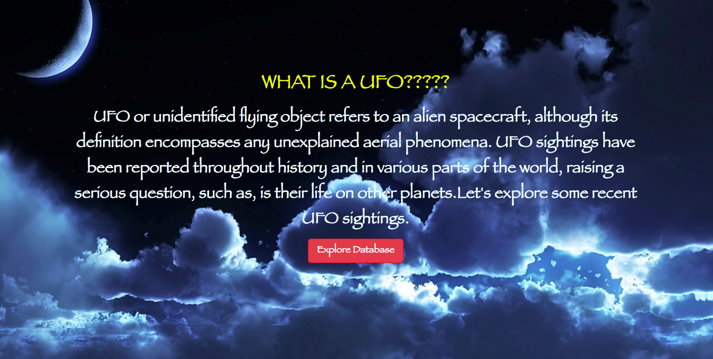
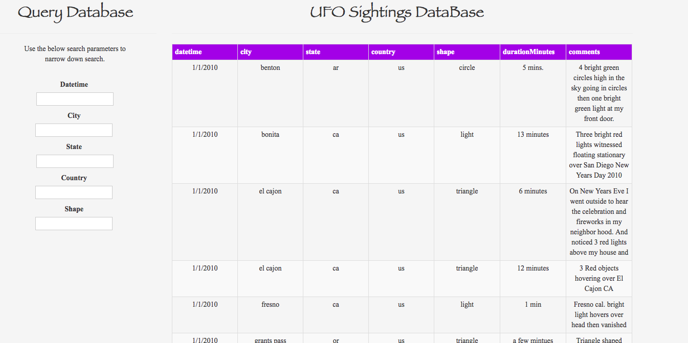
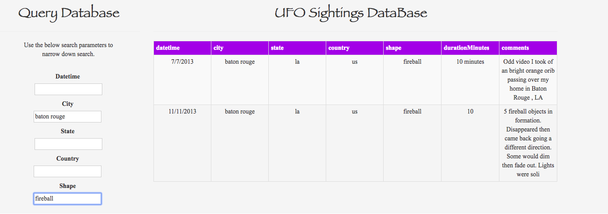
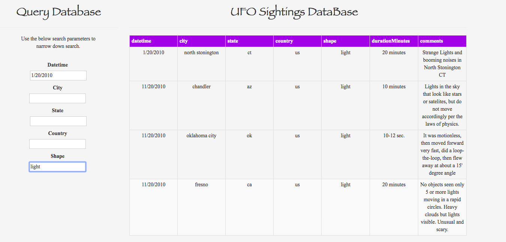

# ufo_web_app

<h1>Mars Web Application</h1>

Instructions: In this project, the goal was to build a web application that only uses pure JavaScript, HTML, and CSS to generate a table and allow a user to dynamically search through the ufo sightings database.

tools used:
<ul>
<li>HTML & CSS</li>
<li>JavaScript</li>
</ul>

<h3>Results</h3>

